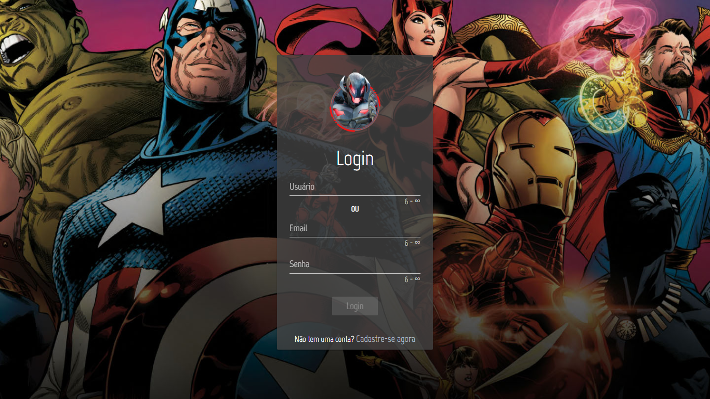
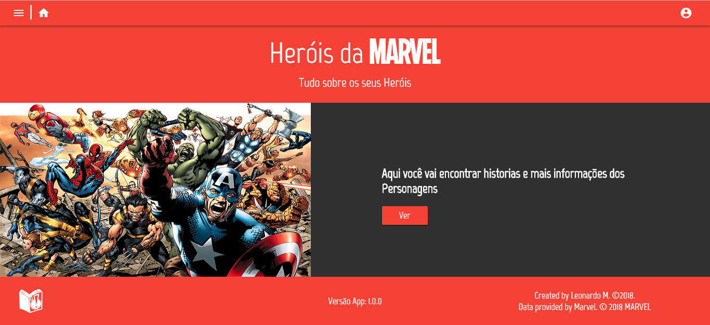
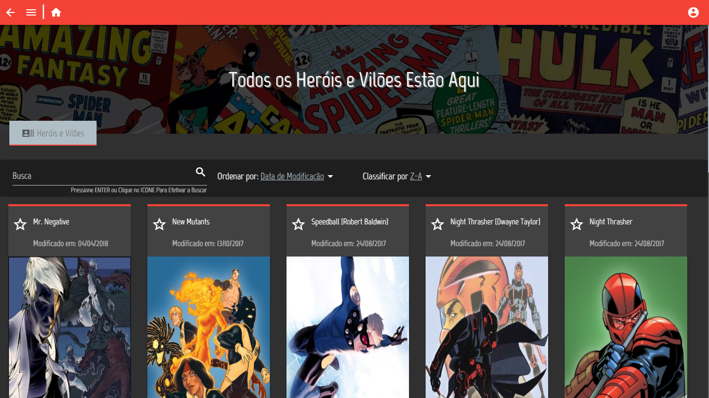
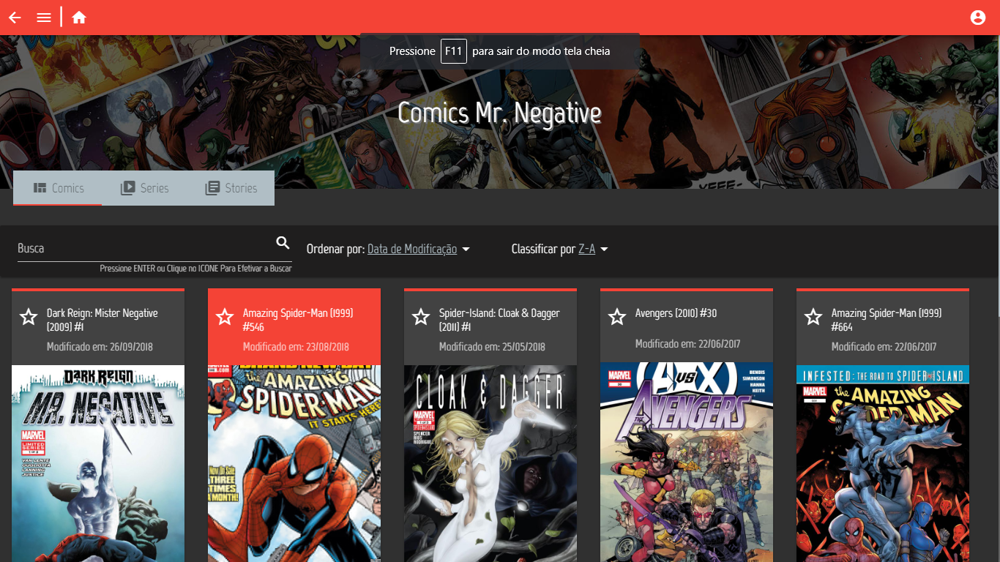
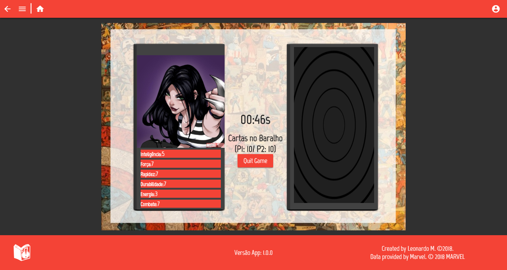
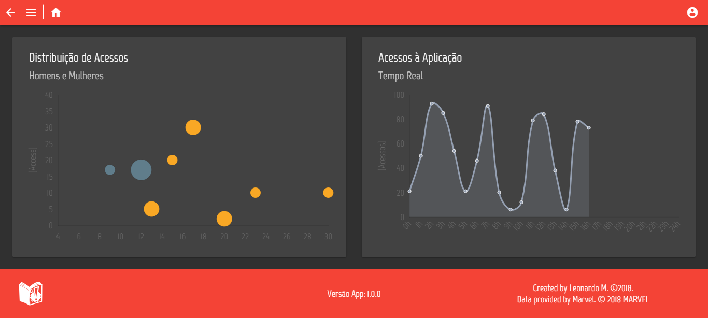

# Point dos Heróis e Vilões

## Sobre o projeto
Este projeto foi criado para um mini-TCC da faculdade. Onde é possivel conhecer todos os heróis da Marvel. Iterar com um game (Super Trunfo Marvel), onde há uma batalha de características.

## Telas
#### Página de Login

#### Página Inicial

#### Personagens

#### Historias em Quadrinhos, Series e Histórias

#### Jogo

#### Estisticas da Aplicação (*Dados Fake)

## Requisitos

Instale o servidor [Node Server](http://nodejs.org/) juntamente com o gerenciador de dependencias [NPM](https://npmjs.org/).
Abaixo estão as versões instaladas que funcionam:

    $ node --version
    v9.6.1

    $ npm --version
    5.6.0

## Começando
Instalando o projeto:

    # Se ainda não tem nenhum repositório local: crie uma pasta, abra-a no terminal e digite o comando abaixo:
    $ git init

#### Front:
    $ git clone https://github.com/leonardomcleite/MarvelProject.git
    $ cd MarvelProject/ang6-heroes-and-villains-point
    $ npm install
    $ npm start

#### Back:
    $ git clone https://github.com/leonardomcleite/MarvelProject.git
    $ cd MarvelProject/ang6-heroes-and-villains-point
    $ npm install
    $ npm start
